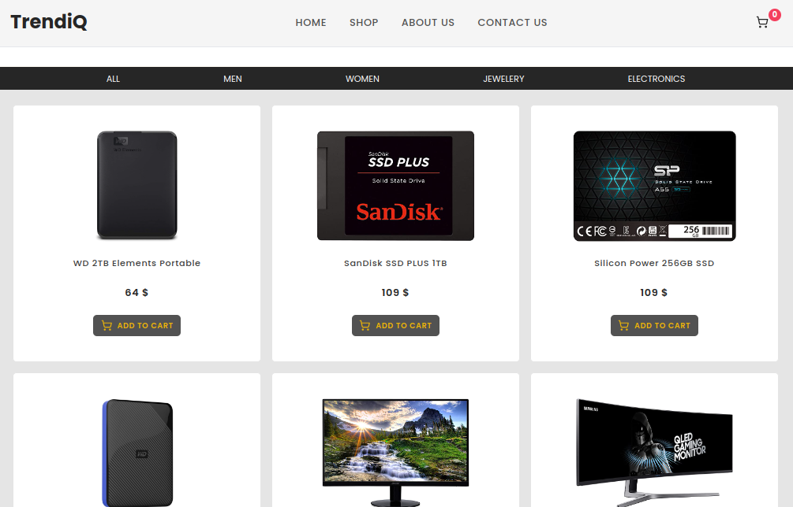

# TrendiQ Shopping Cart

**A simple shopping cart web application built with React. This project was created to practice React Hooks and React Router, showcasing state management and navigation in a React-based application.**

## Screenshot



## Features

- **Product Listing**: Browse products like clothing, electronics, and jewelry.
- **Add to Cart**: Seamlessly add or remove items from the cart.
- **Cart Summary**: View selected items with their total price.
- **Routing**: Navigate between pages using **React Router**.

## Technologies Used

- **React**: For building the UI.
- **React Hooks**: To manage state (e.g., `useState`, `useEffect`).
- **React Router**: For navigation and routing.
- **Tailwind CSS**: For styling the components.

## Installation

1. Clone the repository:

   ```bash
   git clone https://github.com/Penie1/shopping-cart
   ```

## How to Use

1. Navigate to the project directory:

   ```bash
   cd shopping-cart
   ```

2. Install dependencies:

   ```bash
   npm install
   ```

3. Start the development server:

   ```bash
   npm run dev
   ```

4. Launch the app in your browser at `http://localhost:5173/`
